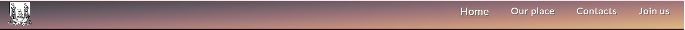
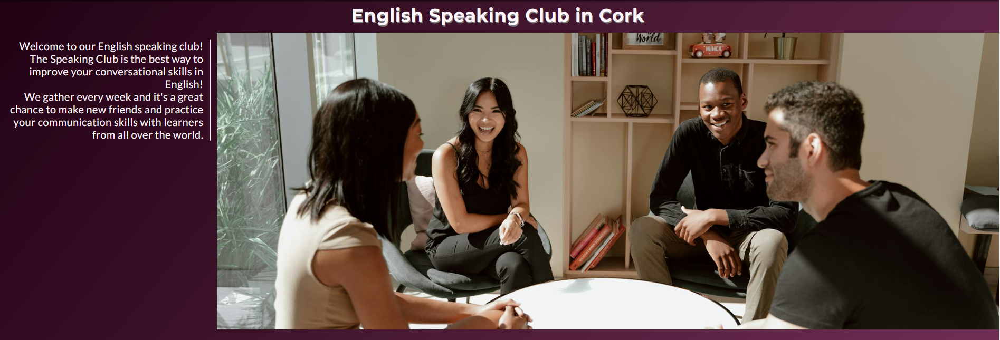
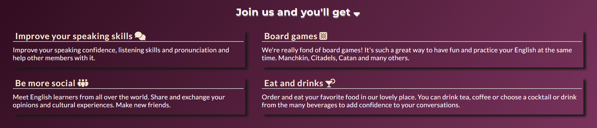
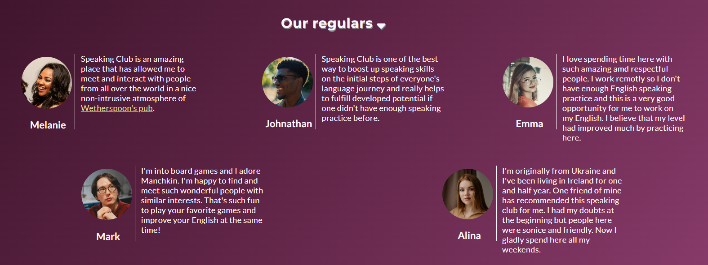
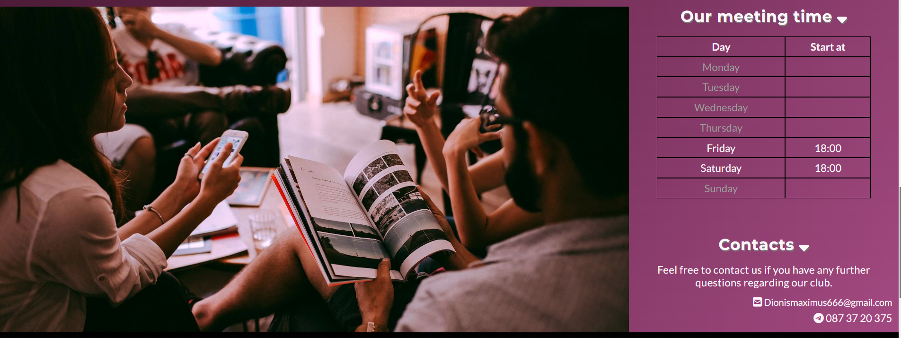
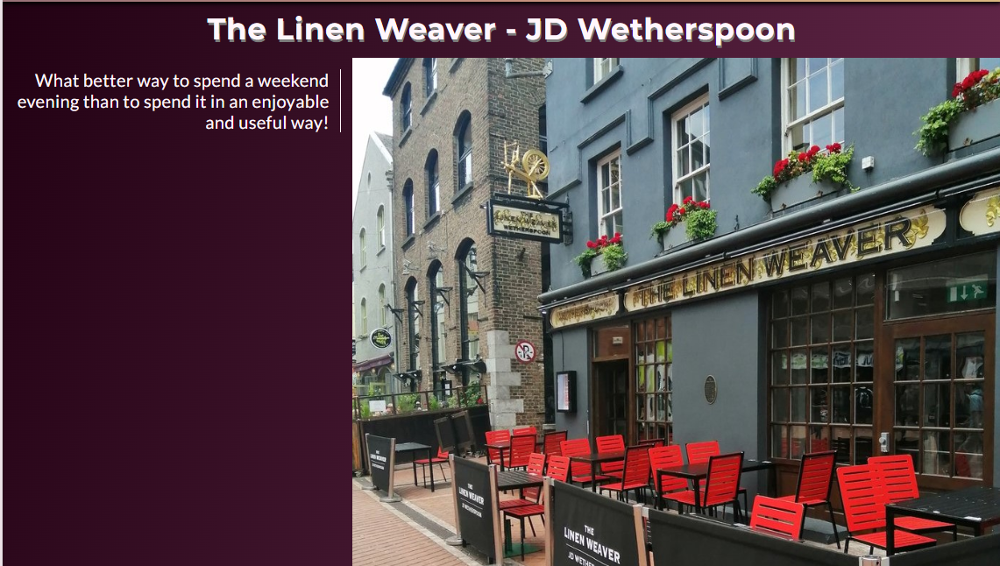

# English Speaking Club in Cork
The English Speaking Club website is a landing page for people who would like to find some place to communicate with another people in English.
The English Speaking Club, which located in Cork in The Linen Weaver - JD Wetherspoon Pub in Cork offers a fun and rewarding experience in a great location.

Users of the site can get all the necessary information about the club, venue, contacts, read the feedback from current members of the club and make an application to join the club.

## Features
- __Navigation__
- Featured at the top of the page, at the very left located the bridge symbol and it also a link to the main home page.
- The main navigation block is at the fixed top page with navigation links: Home, Our place, Contacts, Join us.
- The fixed top of the page accomplished with a gradient colour and nav buttons are highlighted with a different colour depending on which page the user is currently on.
- The mobile version of the website has the nav toggle bar instead usual navigation block.

- __The Header__
- The header shows the name of the club using a little shadow for added dimension.
- The header has the main photo with four members of club.
- The header has a short welcome, brief and clear description of the main purpose of the club.

- __Motivation section__
- The motivation section on the main page contains four blocks of information with the main benefits of club membership.
- The blocks have the headings with a stand-out color and with added blocks shadowing for better user experience.

- __Reviews section__
- Review section has the five reviews from the regulars of the club.
- Every review block has piece of text, picture and name of the member.

- __Join us button__
- Join us button takes users to a Join Us page where a potential user can apply to join the club.

- __Schedule and contacts section__
- It has a schedule sheet completed in a table that is easily perceived by the user.
- Contacts block has phone number and e-mail, where user can get furhter information about the club.

- __Our place page__
- The our place page gives the users an idea of where the weekly club meetings are held.
- It has a few pictures of the interior and exterior of the pub.
- At the bottom of the page is the link to the official The Linen Weaver - JD Wetherspoon website and an embedded google map showing the location of the pub.
